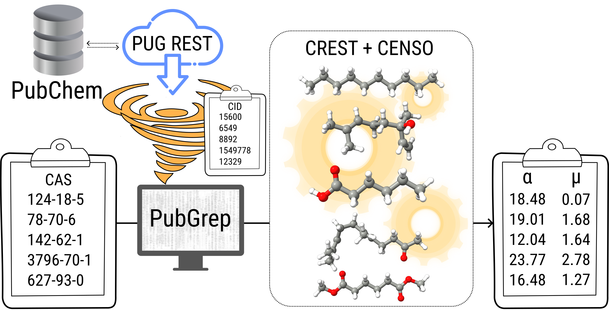

## PubGrep

<div align="center">

</div>

This project provides a simple bash script, that uses the [PUG REST](https://pubchem.ncbi.nlm.nih.gov/docs/pug-rest) API provided by the National Library of Medicine to automatically access the [PubChem](https://pubchem.ncbi.nlm.nih.gov/) Database, based on a list of readily available input data, like CAS numbers, compound names or PubChem CIDs. It can be used to automatically get random conformer structure data (``.sdf`` files) from the PubChem database, if it is available.
The Python implementation additionally enables `xTB`-based optimization of the 3D structures and conversion into other structure formats.

Since the structures obtained with this program are not necessarily the lowest-lying conformers, it is recommended to use conformer screening with [CREST](https://github.com/crest-lab) and [CENSO](https://github.com/grimme-lab/CENSO) afterwards.

If you are using this script extensively for your research, please consider citing the [publication](https://doi.org/10.1039/D3RA01705B).

__WARNING: There's a more recent `Python` and a classical `Bash` implementation of `PubGrep`. While they were developed in the same spirit, the inputs and outputs might not necessarily be exactly similar.__

# Installation

## Bash

If you are using linux, you can just download the repository, add ``PubGrep`` to your path and make it executable by using

```
chmod +x PubGrep
```

## Python

`pubgrep` can be installed into the currently active environment via:

```
pip install -e .
```

All information about how to use the Python variant of ``PubGrep`` are accessible via 
```
pubgrep --help
```

# Usage

The default mode (name based input, structure output) is used by first creating a list with structure information (e.g. CAS numbers). The list can have a simple text (``list.txt``) format and could look like this:

```
124-18-15
78-70-76
142-62-1
3796-70-1
627-93-0
```

PubGrep can then be invoked as
```
PubGrep list.txt
```
which should give you the following output

```
---------------------------------------------------------------------
-                          PubGrep 0.3.1                            -
- This Program tries to search CIDs from the Pubchem Database based -
- on a list of compounds given as Input. Afterwards it creates sdf  -
-   Files for each Compound given in an appropriate subdirectory.   -
-     If you are using this program extensively (like, a lot!)      -
-   for your Research, please consider citing 10.1039/D3RA01705B    -
-                          MS, 2021-2023                            -
---------------------------------------------------------------------

Multiple compound mode, reading input from cas.
Testing Pubchem Server...
Pubchem Server is working fine.

Compound: 124-18-5, CID: 15600
Compound: 78-70-6, CID: 6549
Compound: 142-62-1, CID: 8892
Compound: 3796-70-1, CID: 1549778
Compound: 627-93-0, CID: 12329
Creating directories and sdf files.
15600
6549
8892
1549778
12329
Done!
```

Structure files are created in ``pubchem_compounds`` in their respective directory. Other modes for input and output can be found by calling

```
PubGrep --help
```

# Single Structure mode.

You can also use PubGrep to obtain a single structure quickly from the PubChem Database by adding an identifier directly to the call instead of using the list-based input.

```
PubGrep caffeine 
```

# 2D to 3D conversion (experimental)

Sometimes, for more complex structures, no 3D information is available from the PubChem database. If this is the case, ``PubGrep`` will give you a warning and download the 2D
structure instead. If you have [xTB](https://github.com/grimme-lab/xtb) installed (in your path), PubGrep will try to use the implemented 2D -> 3D converter to give you a 3D structure guess. Use this feature with 
caution and double check the created 3D conformers. An example output (e.g for Taxol) will look like this.

```
Single compound mode for taxol.
Testing Pubchem Server...
Pubchem Server is working fine.

Compound: taxol, CID: 36314
Creating directories and sdf files.
36314
No 3D Conformer Data found for taxol
Retrieving 2D Conformer Data instead.
Using xTB for an attempt to convert the 2D structure to 3D.
normal termination of xtb
3D conversion successfull.
Done!
```


